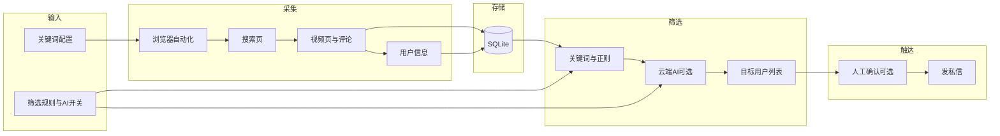
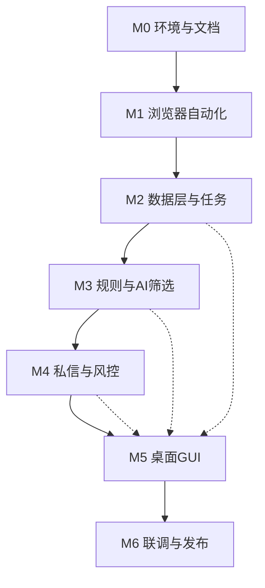

# 抖音助手（Douyin Reach）落地方案 — 总览与文档索引

## 1. 项目概述

- **项目名称**：抖音助手（英文：Douyin Reach）
- **目标客群**：在抖音平台获客的用户（如引流、线索收集、私域转化）。
- **核心价值**：按关键词检索视频 → 提取评论与用户信息 → 按规则或 AI 筛选目标用户 → 发送私信触达。
- **技术路线**：浏览器自动化（抖音 PC 网页版）+ 本地桌面 GUI；单账号；关键词/正则 + 可选云端 AI 筛选；私信支持全自动或人工确认。

## 2. 方案文档结构

整体落地方案按**阶段**拆成独立文档，便于分阶段实施与评审：

| 文档 | 阶段 | 说明 |
|------|------|------|
| [00-总览与索引.md](00-总览与索引.md) | — | 本文档：项目概述、文档索引、整体架构与阶段依赖 |
| [01-阶段0-环境与文档.md](01-阶段0-环境与文档.md) | M0 | 开发环境、落地方案文档骨架、项目目录与仓库规范 |
| [02-阶段1-浏览器自动化基础.md](02-阶段1-浏览器自动化基础.md) | M1 | 自动化框架、登录、搜索页、评论与用户信息、限流与稳健性 |
| [03-阶段2-数据层与任务编排.md](03-阶段2-数据层与任务编排.md) | M2 | 数据模型、SQLite 存储、任务与关键词、采集流水线 |
| [04-阶段3-规则与AI筛选.md](04-阶段3-规则与AI筛选.md) | M3 | 规则配置与引擎、云端 AI 接入、规则+AI 组合、去重与历史 |
| [05-阶段4-私信发送与风控.md](05-阶段4-私信发送与风控.md) | M4 | 私信模板、发送流程、限速与上限、人工确认、失败重试 |
| [06-阶段5-桌面GUI.md](06-阶段5-桌面GUI.md) | M5 | GUI 选型与骨架、任务配置、采集控制、名单审核、设置与账号 |
| [07-阶段6-联调与发布准备.md](07-阶段6-联调与发布准备.md) | M6 | 端到端联调、文档与 README 更新、风险与合规、打包发布 |
| [08-项目经验与关键信息.md](08-项目经验与关键信息.md) | — | 开发中积累：元素选择器、接口与请求、Cookie、风控现象等（随开发逐步完善） |

## 3. 整体架构示意

## 4. 阶段依赖关系

- **实线**：强依赖，前一阶段完成后再进入下一阶段。
- **虚线**：GUI（M5）可随 M2/M3/M4 就绪分步接入（如先做配置与名单审核，再做发送控制）。

## 5. 关键决策汇总

| 维度 | 决策 |
|------|------|
| 平台入口 | 抖音 PC 网页版（douyin.com） |
| 账号策略 | 单账号（预留多账号扩展） |
| 视频检索 | 仅关键词搜索 |
| 评论范围 | 可配置：是否含楼中楼、每视频条数上限 |
| 用户信息 | 最少：昵称、主页链接、评论内容 |
| 筛选方式 | 关键词/正则 + 可选云端 AI |
| AI 提供方 | 云端 API（国内大模型等） |
| 私信能力 | 仅文本模板（支持变量） |
| 产品形态 | 本地桌面 GUI |
| 发信风控 | 可配置：全自动 或 人工确认后发 |
