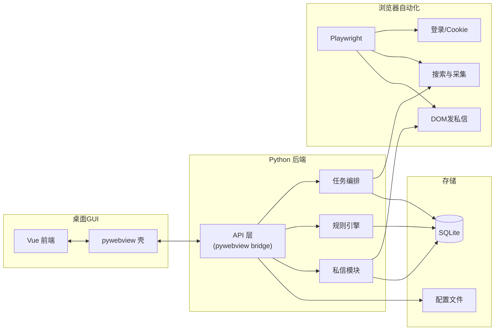
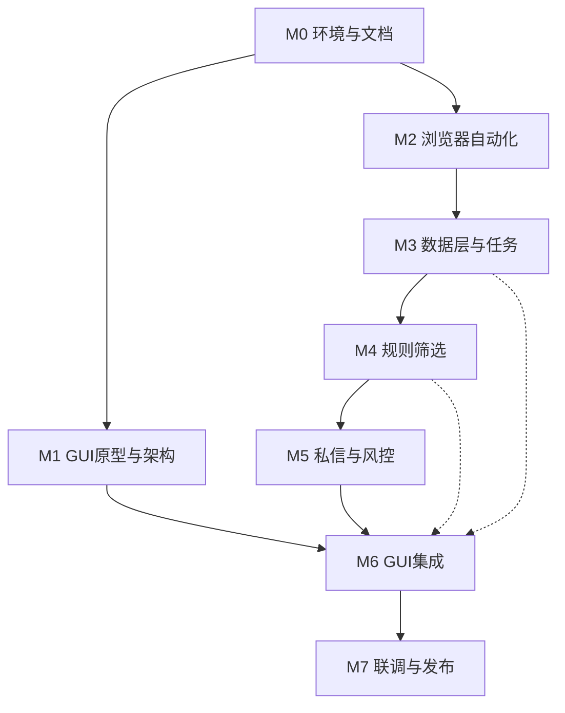

# 抖音助手（Douyin Reach）落地方案 — 总览与文档索引

## 1. 项目概述

- **项目名称**：抖音助手（英文：Douyin Reach）
- **目标客群**：在抖音平台获客的用户（如引流、线索收集、私域转化）。
- **核心价值**：按关键词检索视频 → 提取评论与用户信息 → 按规则筛选目标用户 → 发送私信精准触达。
- **技术路线**：浏览器自动化（抖音 PC 网页版）+ pywebview/Vue 桌面 GUI；单账号；关键词/正则筛选（后期可选云端 AI）；私信支持全自动或人工确认。

### 1.1 核心约束（必读）

> **陌生人私信限制**：抖音对未互关用户，**只能发送一条文字消息**（对方回复或关注你之前无法发第二条）。

这意味着：

- 每个目标用户只有 **一次触达机会**，模板质量直接决定转化率。
- 产品本质是 **"精准首次触达工具"** 而非"私信群发工具"。
- 技术上的"失败重试"仅针对网络/DOM 层面的技术失败，业务层面不存在"重发"。
- 人工确认模式的价值极高——让用户在发送前逐条审核，避免浪费唯一机会。

## 2. MVP 范围定义

### 2.1 MVP 包含

- 搜索关键词 + 采集视频列表与评论/用户信息
- 关键词/正则规则筛选目标用户（不含 AI）
- 私信发送：**全自动模式 + 人工确认模式** 均包含
- 基础桌面 GUI（任务配置、采集控制、名单审核、发送控制、历史查看、登录设置）
- 任务中断与续跑、分级风控、数据导出（CSV）

### 2.2 MVP 不含（后续迭代）

- 云端 AI 筛选（接口预留，不实现）
- 楼中楼评论解析
- 定时/周期任务
- 多模板 A/B 测试
- 转化效果追踪（回复监控）
- 打包发布（PyInstaller / electron-builder）
- 多账号支持
- 代理/IP 轮换

## 3. 方案文档结构

| 文档 | 阶段 | 说明 |
|------|------|------|
| [00-总览与索引.md](00-总览与索引.md) | — | 本文档：项目概述、MVP 定义、架构、阶段依赖 |
| [01-阶段0-环境与文档.md](01-阶段0-环境与文档.md) | M0 | 开发环境、技术栈确认、项目目录与仓库规范 |
| [02-阶段1-GUI原型与架构设计.md](02-阶段1-GUI原型与架构设计.md) | M1 | GUI 技术选型（pywebview+Vue）、界面设计、前后端 API 契约 |
| [03-阶段2-浏览器自动化基础.md](03-阶段2-浏览器自动化基础.md) | M2 | 自动化框架、登录、搜索、评论与用户、分级风控 |
| [04-阶段3-数据层与任务编排.md](04-阶段3-数据层与任务编排.md) | M3 | 数据模型、SQLite、任务状态机、采集流水线、增量采集与断点续跑 |
| [05-阶段4-规则筛选.md](05-阶段4-规则筛选.md) | M4 | 规则引擎（关键词/正则）、去重与历史、AI 接口预留 |
| [06-阶段5-私信发送与风控.md](06-阶段5-私信发送与风控.md) | M5 | DOM 自动化发私信、模板变量、全自动/人工确认、限速与风控 |
| [07-阶段6-GUI集成与功能完善.md](07-阶段6-GUI集成与功能完善.md) | M6 | Mock 替换为真实后端、实时进度、数据导出、全流程串联 |
| [08-阶段7-联调与发布准备.md](08-阶段7-联调与发布准备.md) | M7 | 端到端联调、文档定稿、风险合规、后续迭代路线图 |
| [09-项目经验与关键信息.md](09-项目经验与关键信息.md) | — | 元素选择器、接口抓包、Cookie、风控现象（随开发完善） |
| [10-当前开发进度.md](10-当前开发进度.md) | — | **当前开发进度**：阶段状态、下一步、交付物摘要（随开发更新） |

## 4. 整体架构示意



## 5. 阶段依赖关系



- **M0 之后 M1 和 M2 可并行**：GUI 原型（M1）与浏览器自动化（M2）无直接依赖，可同时启动。
- **M6 是汇合点**：GUI 集成需要 M1（前端骨架）和 M5（全部后端能力）都就绪。
- **虚线**：M6 可随 M3/M4 逐步就绪分批接入（先接采集，再接筛选与发送）。

## 6. 关键决策汇总

| 维度 | 决策 |
|------|------|
| 平台入口 | 抖音 PC 网页版（douyin.com） |
| 账号策略 | 单账号（预留多账号扩展） |
| 视频检索 | 仅关键词搜索 |
| 评论范围 | 一级评论；楼中楼为后续迭代 |
| 用户信息 | 昵称、主页链接、评论内容（最少）；粉丝数/简介等可选 |
| 筛选方式 | MVP：关键词/正则；后续：可选云端 AI |
| 私信技术 | **纯 DOM 自动化**（在私信叠层中定位输入框 → 填入文本 → 回车发送） |
| 私信能力 | 仅文本模板（支持变量）；陌生人限一条消息 |
| 产品形态 | pywebview + Vue 桌面应用 |
| 发信模式 | 全自动 + 人工确认（均在 MVP 内） |
| 风控策略 | 三级响应：正常 → 预警（暂停）→ 危险（停止） |
| 任务中断 | 必选能力：支持断点续跑 |
| 数据导出 | 支持 CSV 导出待触达名单与发送历史 |

## 7. 模块与目录规划

```
douyin-reach/
├── docs/                  # 方案文档
├── src/
│   ├── backend/           # Python 后端
│   │   ├── api/           # pywebview bridge / API 层
│   │   ├── browser/       # Playwright 浏览器自动化
│   │   ├── data/          # SQLite 模型与存储
│   │   ├── filter/        # 规则引擎
│   │   ├── dm/            # 私信发送
│   │   ├── task/          # 任务编排与流水线
│   │   └── utils/         # 工具函数（日志、配置等）
│   └── frontend/          # Vue 前端
│       ├── src/
│       │   ├── views/     # 页面组件
│       │   ├── components/# 通用组件
│       │   ├── api/       # 与后端通信
│       │   └── stores/    # 状态管理
│       └── public/
├── config/                # 示例配置
├── data/                  # 本地数据与 DB（.gitignore）
├── requirements.txt
├── package.json           # 前端依赖
└── README.md
```
