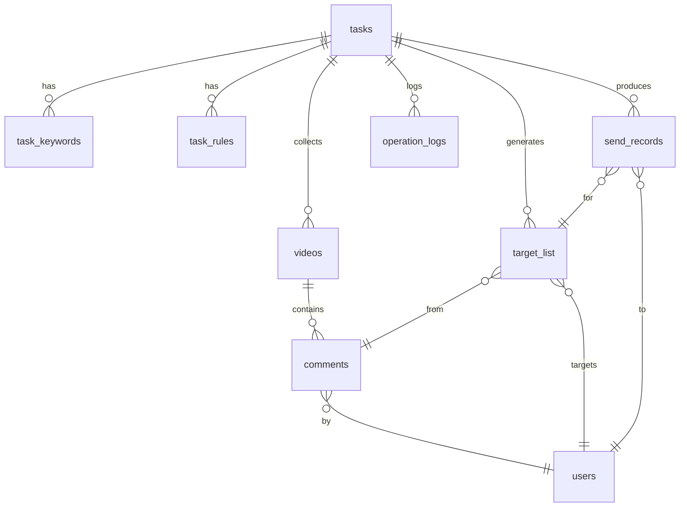
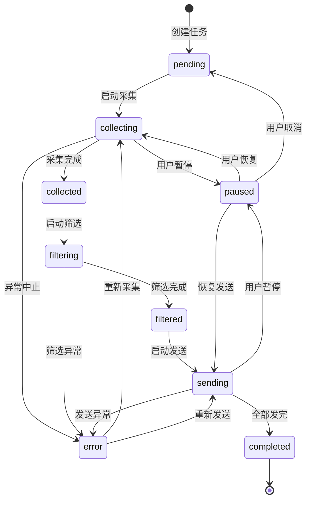

# 阶段 3：数据层与任务编排（M3）

## 1. 阶段目标与范围

- **目标**：设计并实现本地数据模型与存储（SQLite），支持完善的任务状态机与断点续跑，将 M2 的采集能力串联为可中断、可恢复的采集流水线，支持增量采集。
- **范围**：数据表设计、存储接口、任务状态机、流水线编排、进度快照与断点续跑、增量采集逻辑；不包含规则筛选与私信（由 M4、M5 负责）。
- **前置依赖**：M2 已完成（BrowserEngine 接口可用）。
- **接口约束**：实现需符合 M1 定义的 API 契约（`get_tasks`、`start_collection`、`get_collection_progress` 等）。

## 2. 里程碑明细

| 编号 | 里程碑 | 交付物/验收 | 细化说明 |
|------|--------|------------|----------|
| M3.1 | 数据模型设计 | 完整表结构与字段定义；ER 图写入文档 | 见下文 §3.1 完整表设计。核心表：任务、关键词、视频、评论、用户、待触达名单、发送记录、操作日志。 |
| M3.2 | 本地存储实现 | SQLite 建表脚本；Python ORM 或封装层 | 建表脚本或迁移工具；提供 Python 接口：CRUD 任务/视频/评论/用户；去重逻辑（视频按 aweme_id、用户按 sec_uid、评论按 cid）。 |
| M3.3 | 任务状态机 | 状态枚举与转换规则；并发保护 | 见下文 §3.2 状态机设计。状态变更写入 DB 并通过回调通知前端。 |
| M3.4 | 采集流水线 | 按任务执行全流程采集；调用 M2 接口 | 编排：取任务 → 遍历关键词 → 调 M2 搜索视频 → 逐视频拉评论 → 入库。每步完成后更新进度快照。 |
| M3.5 | 断点续跑 | 任务中断后可从未处理处恢复 | **必选能力**：任务表记录 `progress_snapshot`（JSON：当前关键词 index、当前视频 index、已处理视频 ID 列表）。重启后检测未完成任务并提示续跑。 |
| M3.6 | 增量采集 | 已采集视频/评论不重复处理 | 视频维度：已入库的 aweme_id 不再进入评论拉取。评论维度：已入库的 cid 跳过。支持"仅新增"模式（记录上次采集 offset/时间戳）。 |

## 3. 技术要点与实现建议

### 3.1 数据模型（完整表设计）

#### tasks（任务表）

| 字段 | 类型 | 说明 |
|------|------|------|
| id | INTEGER PK | 自增主键 |
| name | TEXT | 任务名称 |
| status | TEXT | 任务状态（见 §3.2） |
| auto_send | BOOLEAN | 全自动发送(1) / 人工确认(0) |
| max_comments_per_video | INTEGER | 每视频评论上限 |
| template | TEXT | 私信模板正文 |
| send_interval | INTEGER | 发送间隔（秒） |
| daily_limit | INTEGER | 日发送上限 |
| task_limit | INTEGER | 任务发送上限 |
| progress_snapshot | TEXT | JSON：采集进度快照 |
| last_error | TEXT | 最后一次错误信息 |
| created_at | DATETIME | 创建时间 |
| updated_at | DATETIME | 更新时间 |

#### task_keywords（任务关键词表）

| 字段 | 类型 | 说明 |
|------|------|------|
| id | INTEGER PK | 自增主键 |
| task_id | INTEGER FK | 关联任务 |
| keyword | TEXT | 搜索关键词 |
| sort_order | INTEGER | 排序序号 |

#### task_rules（任务规则配置）

| 字段 | 类型 | 说明 |
|------|------|------|
| id | INTEGER PK | 自增主键 |
| task_id | INTEGER FK | 关联任务 |
| rule_type | TEXT | whitelist / blacklist / regex_include / regex_exclude |
| pattern | TEXT | 规则内容（关键词或正则） |

#### videos（视频表）

| 字段 | 类型 | 说明 |
|------|------|------|
| id | INTEGER PK | 自增主键 |
| task_id | INTEGER FK | 关联任务 |
| aweme_id | TEXT UNIQUE | 平台视频 ID |
| title | TEXT | 视频标题 |
| url | TEXT | 视频链接 |
| author_nickname | TEXT | 作者昵称 |
| author_sec_uid | TEXT | 作者 sec_uid |
| like_count | INTEGER | 点赞数 |
| comment_count | INTEGER | 评论数 |
| collected_at | DATETIME | 采集时间 |

#### comments（评论表）

| 字段 | 类型 | 说明 |
|------|------|------|
| id | INTEGER PK | 自增主键 |
| video_id | INTEGER FK | 关联视频（内部 ID） |
| cid | TEXT | 平台评论 ID |
| user_id | INTEGER FK | 关联用户（内部 ID） |
| content | TEXT | 评论内容 |
| digg_count | INTEGER | 点赞数 |
| reply_count | INTEGER | 回复数 |
| created_time | INTEGER | 评论发布时间戳 |
| collected_at | DATETIME | 采集时间 |

#### users（用户表）

| 字段 | 类型 | 说明 |
|------|------|------|
| id | INTEGER PK | 自增主键 |
| sec_uid | TEXT UNIQUE | 平台用户标识 |
| nickname | TEXT | 昵称 |
| profile_url | TEXT | 主页链接 |
| follower_count | INTEGER | 粉丝数（可选，补全时填入） |
| following_count | INTEGER | 关注数（可选） |
| bio | TEXT | 简介（可选） |
| is_verified | BOOLEAN | 是否认证（可选） |
| first_seen_at | DATETIME | 首次发现时间 |
| updated_at | DATETIME | 最后更新时间 |

#### target_list（待触达名单）

| 字段 | 类型 | 说明 |
|------|------|------|
| id | INTEGER PK | 自增主键 |
| task_id | INTEGER FK | 关联任务 |
| user_id | INTEGER FK | 关联用户 |
| comment_id | INTEGER FK | 关联评论（命中的那条） |
| matched_rule | TEXT | 命中的规则描述 |
| selected | BOOLEAN | 是否已勾选（人工确认用） |
| created_at | DATETIME | 入名单时间 |

#### send_records（发送记录表）

| 字段 | 类型 | 说明 |
|------|------|------|
| id | INTEGER PK | 自增主键 |
| task_id | INTEGER FK | 关联任务 |
| user_id | INTEGER FK | 关联用户 |
| target_id | INTEGER FK | 关联待触达名单项 |
| message_sent | TEXT | 实际发送的消息内容 |
| status | TEXT | success / failed / pending |
| failure_reason | TEXT | 失败原因 |
| retry_count | INTEGER | 已重试次数 |
| sent_at | DATETIME | 发送时间 |

#### operation_logs（操作日志表）

| 字段 | 类型 | 说明 |
|------|------|------|
| id | INTEGER PK | 自增主键 |
| task_id | INTEGER FK | 关联任务（可为空表示全局日志） |
| level | TEXT | info / warning / error |
| module | TEXT | 来源模块（browser / filter / dm 等） |
| message | TEXT | 日志内容 |
| created_at | DATETIME | 时间 |

#### ER 关系



### 3.2 任务状态机



**状态说明**：

| 状态 | 含义 | 允许的操作 |
|------|------|------------|
| pending | 已创建，待启动 | 编辑、删除、启动采集 |
| collecting | 采集进行中 | 暂停、停止 |
| paused | 已暂停（可恢复） | 恢复、取消 |
| collected | 采集完成 | 启动筛选 |
| filtering | 筛选进行中 | — |
| filtered | 筛选完成 | 启动发送、编辑名单 |
| sending | 发送进行中 | 暂停、停止 |
| completed | 全部完成 | 查看历史 |
| error | 异常中止 | 查看错误、重新启动 |

**并发保护**：同一时刻仅允许一个任务处于 `collecting` 或 `sending` 状态（单浏览器实例限制）。

### 3.3 进度快照格式（JSON）

```json
{
  "phase": "collecting",
  "current_keyword_index": 1,
  "total_keywords": 3,
  "current_keyword": "装修设计",
  "processed_video_ids": ["7592823686873304330", "7591234567890123456"],
  "current_video_index": 5,
  "total_videos_found": 20,
  "total_comments_collected": 87,
  "total_users_collected": 62,
  "last_updated": "2026-02-26T14:30:00"
}
```

### 3.4 增量采集策略

- **视频去重**：查询 DB 中已存在的 aweme_id，跳过已采集视频的评论拉取。
- **评论去重**：查询 DB 中已存在的 cid，跳过重复评论。
- **用户去重**：按 sec_uid 唯一约束，已存在则更新（如刷新粉丝数），不重复插入。
- **增量模式**：任务可标记为"增量"，仅处理上次采集后新增的视频/评论。

## 4. 验收标准

- [ ] 执行一次采集流水线后，DB 中能查到对应任务、视频、评论、用户记录，且无重复（按去重规则）。
- [ ] 任务状态随流程正确更新；状态机中的非法转换被拒绝。
- [ ] 中断采集后重启，能从断点续跑（不重复已处理的视频/评论）。
- [ ] 进度快照实时更新，可被前端轮询获取。
- [ ] 数据模型与 M1 API 契约中的数据类型对齐。

## 5. 产出物清单

- `src/backend/data/` 模块：models（表定义）、db（建表与连接）、crud（增删改查封装）。
- `src/backend/task/` 模块：pipeline（采集流水线）、state（状态机）。
- 建表脚本 / 迁移脚本。
- 数据模型文档（本文档 §3.1）。

## 6. 与后续阶段的关系

- M4 将读取「已采集」任务的评论与用户，执行规则筛选并写入 `target_list`。
- M5 将读取 `target_list` 执行发送并写入 `send_records`。
- M6 将通过 API 层连接前端与本模块的数据查询。
