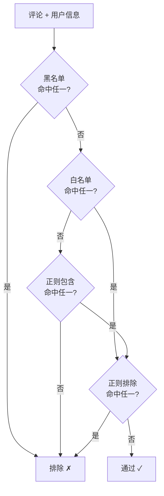

# 阶段 4：规则筛选（M4）

## 1. 阶段目标与范围

- **目标**：在「已采集」的评论与用户数据上，支持关键词/正则规则筛选，产出「待触达名单」并写入存储；支持同一用户去重与已发私信历史校验，避免重复触达。
- **范围**：规则配置与存储、规则引擎、去重与历史校验、AI 接口预留（不实现）。不包含发送行为（由 M5 负责）。
- **前置依赖**：M3 已完成（任务、评论、用户已入库，任务状态含「已采集」）。
- **MVP 说明**：MVP 仅实现关键词/正则规则引擎；云端 AI 筛选在本阶段设计接口但不实现，作为后续迭代。

## 2. 里程碑明细

| 编号 | 里程碑 | 交付物/验收 | 细化说明 |
|------|--------|------------|----------|
| M4.1 | 规则配置格式 | 支持白名单、黑名单、正则包含、正则排除四类规则 | 规则存储在 `task_rules` 表中，与任务关联。白名单：命中任一关键词即保留。黑名单：命中任一即排除。正则包含/排除：支持多条正则。文档给出示例。 |
| M4.2 | 规则引擎 | 对单条评论+用户执行匹配；批量处理任务下全部数据 | 输入：评论内容 + 用户昵称（可选：简介）。执行顺序：① 黑名单排除 → ② 白名单/正则包含命中 → ③ 正则排除过滤。输出：是否通过 + 命中的规则描述。 |
| M4.3 | 去重与历史校验 | 同一用户仅保留一条；已发私信的不再入名单 | 同一 sec_uid 在待触达名单中仅保留一条（优先保留最新评论）。入名单前查询 `send_records` 表，已发送过的用户跳过。支持配置：本任务去重 / 全局去重（跨任务）。 |
| M4.4 | AI 接口预留 | 定义 AI 筛选接口（不实现） | 定义 `AIProvider` 抽象接口：`async def judge(comment, nickname, bio) -> (bool, str)`。预留配置项：API Key、端点、模型名、启用开关。MVP 中开关默认关闭。 |

## 3. 技术要点与实现建议

### 3.1 模块接口定义

```python
class FilterEngine:
    def run_filter(self, task_id: int) -> int:
        """对任务的已采集数据执行规则筛选，返回名单条数"""

    def apply_rules(self, content: str, nickname: str, bio: str | None,
                    rules: list[TaskRule]) -> tuple[bool, str]:
        """对单条数据执行规则匹配，返回 (是否通过, 命中规则描述)"""

    def check_duplicate(self, task_id: int, sec_uid: str,
                        scope: str = "task") -> bool:
        """检查用户是否已在名单或已发送，scope: task/global"""
```

### 3.2 规则执行顺序



**逻辑说明**：
1. 黑名单优先：命中黑名单直接排除。
2. 白名单或正则包含：至少需命中一项才可通过（二者任一即可）。
3. 正则排除最后执行：作为额外过滤，命中则排除。
4. 若任务未配置任何规则，则所有用户通过（等同于不筛选）。

### 3.3 规则配置示例

```json
{
  "rules": [
    {"type": "whitelist", "pattern": "装修"},
    {"type": "whitelist", "pattern": "设计"},
    {"type": "blacklist", "pattern": "广告"},
    {"type": "blacklist", "pattern": "代理"},
    {"type": "regex_include", "pattern": "想.*装修|需要.*设计"},
    {"type": "regex_exclude", "pattern": "^(好|哈哈|666|\\d+)$"}
  ]
}
```

### 3.4 AI 接口预留（后续迭代）

```python
from abc import ABC, abstractmethod

class AIProvider(ABC):
    @abstractmethod
    async def judge(self, comment: str, nickname: str,
                    bio: str | None) -> tuple[bool, str]:
        """判断是否为目标用户，返回 (是否目标, 理由)"""

class CloudAIProvider(AIProvider):
    """后续实现：对接云端大模型 API"""
    def __init__(self, api_key: str, endpoint: str, model: str):
        ...

    async def judge(self, comment, nickname, bio):
        # 后续实现：构造 prompt，调用 API，解析结果
        raise NotImplementedError("AI 筛选为后续迭代功能")
```

支持的组合策略（后续实现）：
- 仅规则（MVP 默认）
- 仅 AI
- 先规则后 AI（规则通过的再调 AI 二次确认，节省 API 调用）

### 3.5 性能考虑

- 规则匹配为纯本地计算，性能不是瓶颈。
- 正则建议预编译（`re.compile`），批量执行时复用。
- 去重查询加索引：`users.sec_uid`、`send_records(task_id, user_id)`。

## 4. 验收标准

- [ ] 对已采集任务执行筛选后，`target_list` 中仅包含通过规则的用户，且同一用户仅一条。
- [ ] 黑名单 > 白名单/正则包含 > 正则排除的优先级正确。
- [ ] 已发过私信的用户不再进入待触达名单。
- [ ] 未配置任何规则时，所有用户通过（不筛选）。
- [ ] AI 接口定义存在，但调用时抛出未实现异常或跳过。

## 5. 产出物清单

- `src/backend/filter/` 模块：engine（规则引擎）、ai_provider（AI 接口抽象，仅定义）。
- 规则执行逻辑与去重/历史校验逻辑。
- 规则配置格式文档与示例（本文档 §3.3）。
- 待触达名单写入与任务状态更新（collected → filtering → filtered）。

## 6. 与后续阶段的关系

- M5 将读取 `target_list` 执行发私信，并写入 `send_records`（供本阶段 M4.3 历史校验）。
- M6 将通过 API 连接前端的名单审核页与本模块。
- 后续迭代将实现 `CloudAIProvider` 并增加"先规则后 AI"组合策略。
