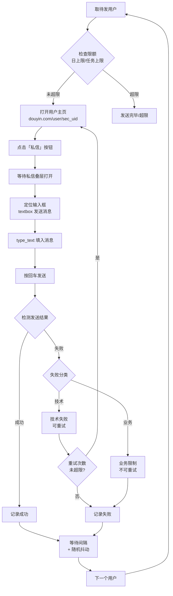

# 阶段 5：私信发送与风控（M5）

## 1. 阶段目标与范围

- **目标**：从待触达名单中取用户，通过 DOM 自动化在抖音私信叠层中发送消息；支持模板变量、全自动与人工确认两种模式、限速与上限、失败处理。
- **范围**：私信模板与变量、DOM 发送流程、限速与上限、两种发送模式、失败分类与重试。不包含名单的生成与 GUI 展示（由 M4、M6 负责）。
- **前置依赖**：M2（浏览器环境）、M3（任务与用户数据）、M4（待触达名单）。
- **技术路径**：**纯 DOM 自动化**——在私信叠层中定位输入框、填入文本、回车发送。不逆向 protobuf 接口。

### 1.1 核心约束再强调

> **陌生人只能发一条消息**：对方回复或关注你之前，无法发第二条。

- 每个用户只有 **一次触达机会**，发送前的审核极其重要。
- "失败重试"仅针对 **技术失败**（DOM 操作超时、网络异常），不针对业务限制。
- 已发送成功的用户 **永远不会再次发送**，无论任何模式。

## 2. 里程碑明细

| 编号 | 里程碑 | 交付物/验收 | 细化说明 |
|------|--------|------------|----------|
| M5.1 | 私信模板与变量 | 模板支持变量替换；渲染与预览 | 模板为字符串，支持占位符 `{昵称}`、`{评论摘要}`、`{视频标题}`。发送前根据当前用户与评论替换。提供模板预览方法（给定用户数据，返回渲染后的文本）。 |
| M5.2 | DOM 发送流程 | 在浏览器中完成：打开私信 → 定位输入框 → 填入 → 发送 → 检测结果 | 见下文 §3.2 详细流程。核心步骤：从用户主页点击「私信」打开叠层 → 定位输入框 → type_text 填入渲染后的消息 → 回车发送 → 检测是否发送成功（DOM 中新增消息气泡或失败提示）。 |
| M5.3 | 全自动模式 | 从待触达名单自动取用户并依次发送 | 当任务配置 `auto_send=True` 时，启动发送后自动遍历 `target_list` 中状态为 unsent 的用户，依次执行 M5.2 流程。每次发送后等待配置的间隔时间。 |
| M5.4 | 人工确认模式 | 仅对已勾选的用户发送 | 当任务配置 `auto_send=False` 时，仅对 `target_list` 中 `selected=True` 且 `send_status=unsent` 的用户执行发送。用户通过 GUI 名单审核页勾选后触发。 |
| M5.5 | 限速与上限 | 发送间隔、日上限、任务上限；超限停止 | 每次发送后等待「发送间隔」秒（加随机抖动 ±30%）。计数器：当日已发数（跨任务）、本任务已发数，任一达上限则停止并更新状态。 |
| M5.6 | 失败分类与处理 | 技术失败可重试；业务限制标记为终态 | 见下文 §3.4 失败分类表。 |

## 3. 技术要点与实现建议

### 3.1 模块接口定义

扩展 M2 的 `BrowserEngine`，新增私信能力：

```python
class DMSender:
    def __init__(self, browser: BrowserEngine, db: Database):
        ...

    async def send_dm(self, sec_uid: str, message: str) -> SendResult:
        """向指定用户发送私信，返回发送结果"""

    async def start_batch_send(self, task_id: int) -> None:
        """批量发送（全自动或人工确认模式）"""

    async def pause_batch_send(self) -> None:
        """暂停批量发送"""

    async def stop_batch_send(self) -> None:
        """停止批量发送"""

    def render_template(self, template: str, user: User,
                        comment: Comment, video: Video) -> str:
        """渲染模板变量"""

    def preview_template(self, template: str, sample_data: dict) -> str:
        """预览模板效果"""
```

```python
class SendResult:
    success: bool
    failure_type: str | None   # technical / business / None
    failure_reason: str | None
    retryable: bool
```

### 3.2 DOM 发送流程



### 3.3 发送结果检测

发送后需检测是否成功，方法：

1. **成功标志**：私信对话区出现新的消息气泡，且内容与发送内容一致。
2. **失败标志**：
   - 出现「发送失败」文案
   - 出现「对方回复或关注你之前，只能发送一条文字消息」提示（说明已发过一条）
   - 输入框内容未清空（发送失败时内容可能保留）
   - 超时未出现新消息气泡
3. **检测超时**：等待最多 5 秒；超时视为技术失败。

### 3.4 失败分类

| 失败类型 | 典型场景 | 可重试 | 处理方式 |
|----------|----------|--------|----------|
| **技术失败** | 元素未找到、点击无响应、页面超时、网络断开 | 是（最多 2 次） | 重试，重试仍失败则记录并跳过 |
| **业务限制** | 「只能发一条消息」（已发过）、用户不存在、用户关闭私信 | 否 | 标记为终态失败，永不重试 |
| **风控触发** | 发送后出现验证码、滑块、账号异常提示 | 否 | 触发分级风控（预警/危险），暂停或停止任务 |

### 3.5 模板变量

| 变量 | 替换为 | 示例 |
|------|--------|------|
| `{昵称}` | 用户昵称 | 小明 |
| `{评论摘要}` | 用户评论内容（截取前 20 字） | 想找个靠谱的装修公司... |
| `{视频标题}` | 来源视频标题（截取前 20 字） | 2026年装修避坑指南... |
| `{关键词}` | 触发搜索的关键词 | 装修设计 |

模板示例：
```
你好{昵称}，看到你在「{视频标题}」下的评论，我们这边有专业的装修设计服务，有兴趣可以聊聊~
```

### 3.6 限速参数

| 参数 | 默认值 | 说明 |
|------|--------|------|
| send_interval | 45 秒 | 两次发送之间的基础间隔 |
| interval_jitter | 0.3 | 间隔随机抖动比例（±30%） |
| daily_limit | 30 | 单日发送上限（跨任务累计） |
| task_limit | 50 | 单任务发送上限 |
| max_retry | 2 | 技术失败最大重试次数 |
| retry_backoff | 10 秒 | 重试退避时间 |

**保守原则**：默认值偏保守，用户可自行调高但需理解风险。

## 4. 验收标准

- [ ] 能自动完成：取一名用户 → 打开其主页 → 点击私信 → 填入模板 → 发送 → 检测成功/失败，并写入 `send_records`。
- [ ] 全自动模式：能自动遍历待发名单依次发送，间隔与上限生效。
- [ ] 人工确认模式：仅发送已勾选用户，未勾选用户不发送。
- [ ] 技术失败可重试；业务限制标记为终态不重试。
- [ ] 日上限/任务上限达到后自动停止，不再发送。
- [ ] 模板变量正确替换；变量缺失时以空字符串替代而非报错。

## 5. 产出物清单

- `src/backend/dm/` 模块：sender（发送逻辑）、template（模板渲染）。
- 发送流程与结果检测逻辑。
- 限速与上限配置；失败分类与重试逻辑。
- 发送记录写入 `send_records` 表。

## 6. 与后续阶段的关系

- M4 依赖本模块写入的 `send_records` 做「已发私信」历史校验。
- M6 将通过 API 层连接前端的发送控制页与本模块（启动/暂停/停止发送、获取进度）。
- 后续迭代：多模板轮换、A/B 测试、回复监控。
