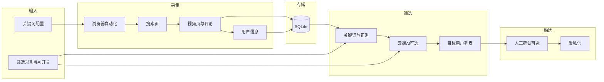
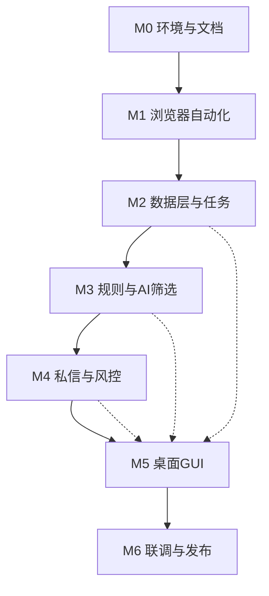

**各阶段已拆分为独立细化文档，见 [00-总览与索引.md](00-总览与索引.md) 及 [01-阶段0-环境与文档.md](01-阶段0-环境与文档.md)～[07-阶段6-联调与发布准备.md](07-阶段6-联调与发布准备.md)。**

# 抖音助手（Douyin Reach）落地方案与里程碑规划

## 一、方案文档建议结构

落地方案文档建议包含以下章节，便于后续按章实施与评审：

| 章节           | 内容要点                                                                                        |
| ------------ | ------------------------------------------------------------------------------------------- |
| 1. 项目概述      | 项目名（抖音助手 / Douyin Reach）、目标客群、核心价值、技术路线（浏览器自动化 + 桌面 GUI）                                    |
| 2. 功能范围      | 功能清单与优先级；与你已选能力对齐：PC 网页版、单账号、仅关键词检索、可配置评论/楼中楼、昵称+主页链接+评论内容、关键词/正则+可选云端 AI、仅文本私信、可配置全自动/人工确认 |
| 3. 技术架构      | 技术栈选型、模块划分、数据流、与抖音网页的交互边界（只做自动化，不逆向我方接口）                                                    |
| 4. 浏览器自动化方案  | 目标页面（搜索页、视频页、评论区、个人主页、私信页）、元素定位策略、登录与 Cookie、反检测与限流策略                                       |
| 5. 数据模型与存储   | 视频、评论、用户、任务、规则、发送记录等实体与表结构；本地 DB 选型（如 SQLite）                                               |
| 6. 规则与 AI 筛选 | 关键词/正则配置格式、规则引擎流程、云端 AI 调用（接口抽象便于换国内大模型）、结果与日志                                              |
| 7. 私信发送与风控   | 模板与变量、发送间隔与日上限、全自动/人工确认模式、失败重试与记录                                                           |
| 8. GUI 设计要点  | 主界面、任务配置、名单审核、日志与统计；技术选型（如 PyQt/Electron）                                                   |
| 9. 风险与合规     | 账号安全、平台规则、隐私与数据留存、建议使用方式                                                                    |
| 10. 里程碑与排期   | 下文的细粒度里程碑，与文档章节对应                                                                           |

---

## 二、整体架构示意

---

## 三、细粒度里程碑目标

以下按阶段拆成小步，便于验收与排期。

### 阶段 0：环境与文档（M0）

| 编号   | 里程碑       | 交付物/验收                                                                     |
| ---- | --------- | -------------------------------------------------------------------------- |
| M0.1 | 开发环境统一    | 文档：Python 版本、Node 版本（若用 Electron）、依赖管理方式（venv + requirements.txt 或 poetry） |
| M0.2 | 落地方案文档初版  | 完成上述 1～10 章骨架，关键决策（平台、账号、筛选、AI、风控）写入文档                                     |
| M0.3 | 项目目录与仓库规范 | 目录结构（如 `docs/`、`src/`、`config/`、`data/`）、README、.gitignore                 |

### 阶段 1：浏览器自动化基础（M1）

| 编号   | 里程碑     | 交付物/验收                                              |
| ---- | ------- | --------------------------------------------------- |
| M1.1 | 自动化框架接入 | 选定并集成 Playwright（推荐）或 Selenium；能启动浏览器、打开 douyin.com |
| M1.2 | 登录与会话保持 | 实现扫码/密码登录流程；Cookie 持久化与复用；文档记录登录方式与安全注意             |
| M1.3 | 搜索页解析   | 根据关键词打开搜索页、滚动加载、解析视频列表（标题、链接、作者、点赞等可拿字段）            |
| M1.4 | 单视频评论拉取 | 进入单个视频页、滚动评论区、解析一级评论（内容、用户昵称、用户链接）；可配置每视频条数上限       |
| M1.5 | 楼中楼可选   | 可配置开关：是否展开并解析楼中楼；与 M1.4 共用「每视频条数」上限逻辑               |
| M1.6 | 用户信息补全  | 从评论进入用户主页（或评论内已有信息），提取：昵称、主页链接（必选）；可选存评论内容与来源视频 ID  |
| M1.7 | 限流与稳健性  | 随机延时、失败重试、单日/单任务请求量上限；记录失败原因便于排查                    |

### 阶段 2：数据层与任务编排（M2）

| 编号   | 里程碑      | 交付物/验收                                            |
| ---- | -------- | ------------------------------------------------- |
| M2.1 | 数据模型设计   | 表：关键词/任务、视频、评论、用户、规则配置、发送记录；ER 或字段说明写入方案文档        |
| M2.2 | 本地存储实现   | SQLite 建表与迁移方式；封装「写入视频/评论/用户」的接口                  |
| M2.3 | 任务与关键词绑定 | 支持多关键词 per 任务；任务状态：待执行/采集中/已采集/已筛选/已发送            |
| M2.4 | 采集流水线串联  | 按任务执行：关键词 → 搜索 → 视频列表 → 逐视频评论+用户 → 入库；支持中断与续跑（可选） |

### 阶段 3：规则与 AI 筛选（M3）

| 编号   | 里程碑      | 交付物/验收                                                   |
| ---- | -------- | -------------------------------------------------------- |
| M3.1 | 规则配置格式   | 关键词白名单/黑名单、正则列表；配置文件或 DB 存储；文档说明格式                       |
| M3.2 | 规则引擎     | 对单条「评论+用户」执行关键词/正则匹配；输出布尔或标签；批量跑任务下全部新数据                 |
| M3.3 | 云端 AI 接入 | 抽象「意向判断」接口；对接一家云端 API（如国内大模型）；输入：评论+昵称/简介，输出：是否目标用户或简单理由 |
| M3.4 | 规则+AI 组合 | 支持「仅规则」「仅 AI」「先规则后 AI」等策略；生成「待触达名单」并写入 DB                |
| M3.5 | 去重与历史    | 同一用户多评论只保留一条；是否已发过私信的历史校验，避免重复触达                         |

### 阶段 4：私信发送与风控（M4）

| 编号   | 里程碑     | 交付物/验收                                   |
| ---- | ------- | ---------------------------------------- |
| M4.1 | 私信模板与变量 | 模板支持变量（如 `{昵称}`、`{评论摘要}`）；配置存储与渲染逻辑      |
| M4.2 | 发送流程自动化 | 从待触达列表取用户，打开其主页或私信入口，填入内容并发送；记录成功/失败     |
| M4.3 | 限速与上限   | 可配置：发送间隔（秒）、单日上限、单任务上限；超限即停并记录           |
| M4.4 | 人工确认模式  | 可配置：仅生成名单 / 生成后需在 GUI 勾选确认再发；名单导出与「已选」回写 |
| M4.5 | 失败与重试   | 发送失败（网络/风控）记录原因；可配置重试次数与退避策略             |

### 阶段 5：桌面 GUI（M5）

| 编号   | 里程碑         | 交付物/验收                                       |
| ---- | ----------- | -------------------------------------------- |
| M5.1 | GUI 技术选型与骨架 | 选定 PyQt 或 Electron + 本地后端；主窗口、导航或 Tab 结构     |
| M5.2 | 任务配置界面      | 关键词录入、评论条数/楼中楼开关、规则与 AI 开关、私信模板与风控参数         |
| M5.3 | 采集控制与进度     | 启动/暂停/停止采集；当前任务与进度展示；简单日志流                   |
| M5.4 | 名单审核界面      | 待触达列表展示（昵称、评论、来源）；勾选/全选；人工确认后触发发送            |
| M5.5 | 发送与历史       | 发送队列状态、成功/失败统计；历史发送记录查询                      |
| M5.6 | 设置与账号       | 登录入口、Cookie/账号状态；AI API 配置（密钥、端点）；全局限速与上限默认值 |

### 阶段 6：联调、文档与发布准备（M6）

| 编号   | 里程碑             | 交付物/验收                                                  |
| ---- | --------------- | ------------------------------------------------------- |
| M6.1 | 端到端联调           | 从「配置任务」到「名单生成」到「发私信」全流程在真实环境跑通一次                        |
| M6.2 | 方案文档与 README 更新 | 将实际技术选型、接口约定、配置项写入落地方案文档；README 安装与运行说明                 |
| M6.3 | 风险与合规说明定稿       | 文档第 9 章：账号安全、平台规则、隐私与建议用法                               |
| M6.4 | 发布与打包（可选）       | 本地可执行包或安装器（如 PyInstaller 或 Electron builder）；不包含密钥与敏感信息 |

---

## 四、依赖关系简图

- 实线：强依赖（前一阶段完成再进入下一阶段）。
- M2/M3/M4 与 M5 的虚线：GUI 可随数据与业务就绪分步接入（如先做配置与名单审核，再做发送控制）。

---

## 五、文档与代码产出清单（汇总）

- **方案文档**：一份主文档覆盖上述 10 章，随里程碑更新（尤其是 4、5、6、7、8、10 章）。
- **里程碑验收**：每完成一个小格（如 M1.3）即在文档或 README 中标记，便于跟踪。
- **可选项**：楼中楼、AI 筛选、人工确认均为可配置，可在 MVP 先关闭，后续按需开启。

若你希望把「落地方案文档」的章节再拆成单独文件（如 `docs/01-overview.md`、`docs/02-scope.md` …），可在实施阶段在 M0.2 中一并定好文档拆分规范。